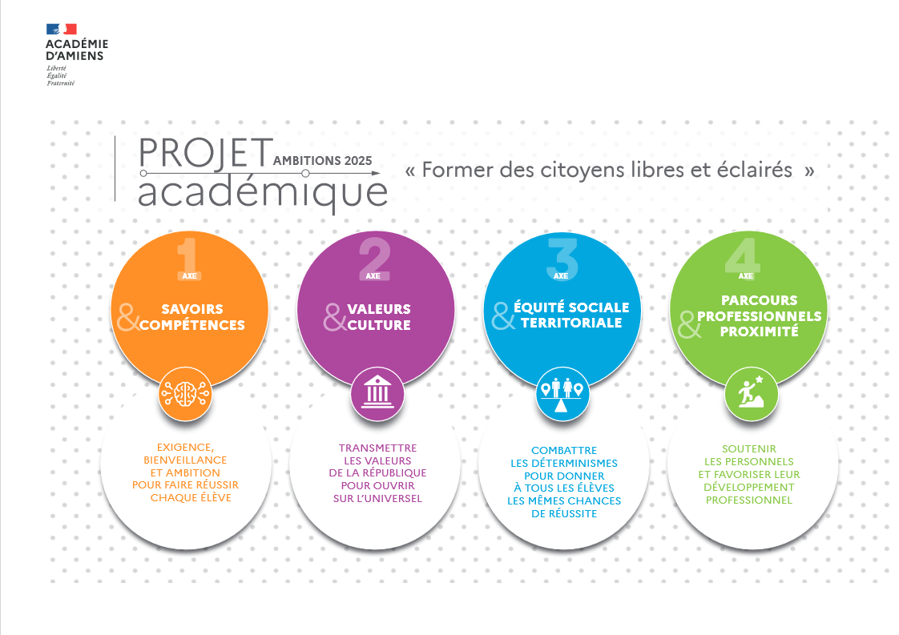

# Projets Académiques

Bienvenue dans le dépôt de mes projets académiques. Cette collection présente divers devoirs, recherches et expériences réalisés au cours de mes études.

## Contenu

- Descriptions des projets
- Code source
- Documentation
- Résultats et analyses

## Exemple de code

Voici un exemple de fonction Python pour calculer la moyenne :

```python
def calculer_moyenne(notes):
    return sum(notes) / len(notes)
```

## Aperçu visuel



## Tableau récapitulatif

| Projet         | Langage   | Statut    |
|----------------|-----------|-----------|
| Analyse de données | Python    | Terminé   |
| Site web       | HTML/CSS   | Terminé  |
| Simulation     | MATLAB     | À venir   |

*Le dépôt existe pour déposer mes projets existants*

## Pour commencer

Clonez le dépôt :

```bash
git clone https://github.com/yanisstentzel/academicprojects
```

Explorez chaque dossier de projet pour des instructions spécifiques.

